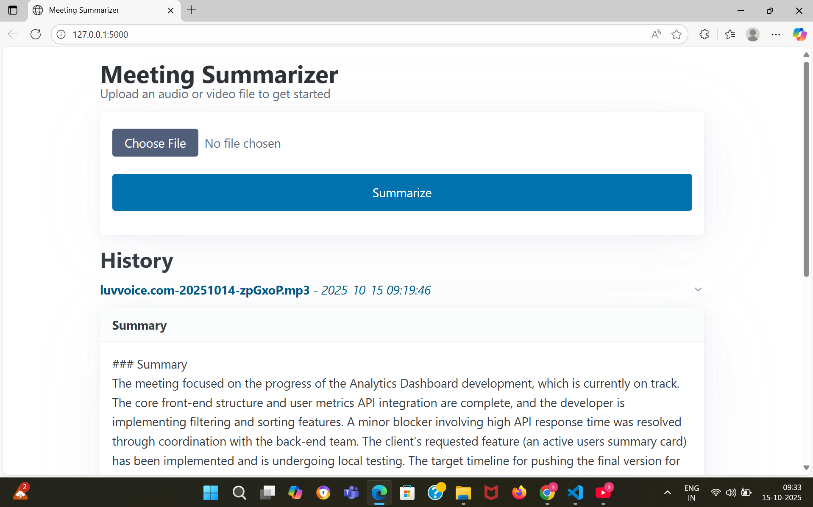

# Meeting Summarizer (Enhanced Version)

## Demo Video

Click the thumbnail below to watch the demo:

[](https://drive.google.com/file/d/1P-nYDYvhO2ffVvaVHODw0H9OstdB2nK0/view?usp=sharing)

## Objective
[cite_start]This project is designed to transcribe meeting audio and video files and generate action-oriented summaries[cite: 3]. It features a polished web interface for uploading files, a persistent history of past summaries, and is fully containerized with Docker for easy deployment and portability.

## Features
-   [cite_start]**Audio and Video Transcription**: Accepts both audio (`.mp3`, `.m4a`, `.wav`) and video (`.mp4`, `.mov`) files as input[cite: 6]. It automatically extracts the audio from video files for processing.
-   [cite_start]**AI-Powered Summarization**: Uses the Google Gemini API to generate a structured summary of the meeting transcript, highlighting key decisions and action items[cite: 12, 14].
-   [cite_start]**Polished Web Interface**: A clean and modern frontend built with Flask and the Pico.css framework provides an excellent user experience. [cite: 8]
-   **Persistent History**: Automatically saves every generated summary to a local SQLite database. Past summaries are displayed on the main page for easy access.
-   **Dynamic UI Elements**: Includes a loading indicator while processing and a "Copy to Clipboard" button for easily sharing the summary text.
-   **Container-Ready**: Comes with a complete `Dockerfile`, allowing the application and all its dependencies to be run anywhere Docker is installed.

## Tech Stack
-   **Backend**: Python, Flask
-   **Database**: SQLite
-   **Transcription (ASR)**: OpenAI Whisper (running locally)
-   **Summarization (LLM)**: Google Gemini API
-   **Video Processing**: MoviePy
-   **Frontend**: HTML, Pico.css, JavaScript
-   **Containerization**: Docker

## Setup and Installation

Follow these steps to set up and run the project locally.

**1. Prerequisites:**
-   Python 3.8+
-   **`ffmpeg`**: A required system dependency for audio and video processing.
    -   On Windows, install via [Chocolatey](https://chocolatey.org/): `choco install ffmpeg`
    -   On macOS, install via [Homebrew](https://brew.sh/): `brew install ffmpeg`

**2. Clone the Repository:**
```bash
git clone <your-github-repository-url>
cd <repository-folder-name>
3. Create and Activate Virtual Environment:

Bash

# Create the environment
python -m venv venv

# Activate on Windows
.\venv\Scripts\activate

# Activate on macOS/Linux
source venv/bin/activate
4. Install Dependencies:

Bash

pip install -r requirements.txt
5. Set Up Environment Variables:

Create a new file in the root directory named .env.

Open the file and add your Google Gemini API key:

GOOGLE_API_KEY="AIzaSy...Your...Google...Key..."
How to Run
There are two ways to run the application:

Method 1: Local Development
Start the Flask server:

Bash

python app.py
Open your web browser and navigate to: http://127.0.0.1:5000

Method 2: Using Docker (Recommended for Consistency)
Ensure you have Docker Desktop installed and running.

Build the Docker image:

Bash

docker build -t meeting-summarizer .
Run the Docker container:

Bash

# For Windows (PowerShell)
docker run -p 5000:5000 -v "${PWD}:/app/database" meeting-summarizer

# For macOS/Linux
docker run -p 5000:5000 -v "$(pwd):/app/database" meeting-summarizer
Open your web browser and navigate to: http://127.0.0.1:5000

How to Use
Click the "Choose File" button to select an audio or video file.

Click the "Summarize" button.

Wait for the processing to complete. The transcript and summary will appear on the page.

The summary is automatically saved. Refresh the page at any time to see the updated history list.
